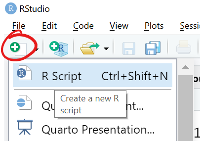
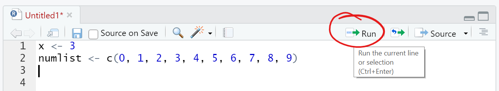
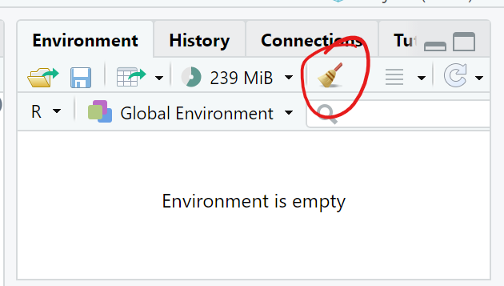

# Module 16 - R

## Module Supplement 

*Note: The images in the module have RStudio in a dark mode theme, my images will be in a light mode theme. However, the applications are the same.*

*Note: Throughout this module when code samples are given, sometimes they are given with a `>` character at the beginning. You do not need to copy this character when pasting into your R script. It is simply the input character that you typically see in the console. Just as with Javascript and using the console on your browser, you can either paste this code into your Script itself and run it or you can paste the code into the R studio console pane and see the same results. When you see that character, the module is expecting you to just type the code into the console; however, if you want to save the code you are running I would recommend putting it in an Rscript and maybe including more notes around what each thing is so you can refer to the code again later*

*Note: Each time you close and re-open RStudio, you will need to reset your working directory to whichever folder you are working in. The module will explain how to set your working directory. You may also need to re-load in any libraries that you were using by typing `library(<package_name>)` into the console or into your RScript to be ran. So please keep note of the ones the module asks you to use. I would actually recommend putting the library functions at the top of your R scripts so they are there to load in each time you reopen Rstudio and those files*

## 16.1.3 - Install RStudio

- After following the steps to install R, you are to navigate to the RStudio Download Page and select the appropriate installer link. Be sure to scroll down on that page to find the installer links. The page opens up with a Step 1 to install R, which you've already done.

**Navigate and Configure RStudio**
- When I opened RStudio, it did not default with an untitled RScript file. If yours does not either, you can simply click the New Script button below *File* 
    - 

- To install the required packages, you will need to scroll down in the Console pane until you see the `>` for input. This is where you can paste the install strings [don't include the > character] (ex: paste in `install.packages("tidyverse")`) provided in the module. Please note that some of these installs will take a moment to complete. 

- When creating the working directory, I would recommend having this folder somewhere on your Desktop or within an organized folder that you use for class work/challenges so that you easily know how to navigate to it.

## 16.2.1 - Fundamentals of R Programming

- You can copy the code samples given into your untitled script source. If you want to run the code, simply click the `Run` button. Be aware that this will run the current line that your cursor is on, or whatever code you have highlighted.
    - 

## 16.2.3 - Read and Write Using R

- If you copied code into an untitled script from the sections above in order to follow along, you can now clear out that code or simply open a new one before reading in the csv file that you downloaded from the module.
    - You may also want to clear out any values from your environment by clicking on the broom icon in the environment pane
        - 
    - *Before you can read in the CSV file, make sure to move it into the `01_Demo` folder that should be your current active directory*

## 16.2.5 - Transform, Group, and Reshape Data Using the Tidyverse Package

- When using the `mutate` function, if you get an error that says `could not find function "%>%"` you may want to also try loading the dplyr library by typing in `library(dplyr)`. This shouldn't be required after loading the tidyverse library as the module instructs `library(tidyverse)` but I've seen some cases where it happens because the tidyverse's dplyr install did weird.

*Reshape Data*
- Make sure as you are using the gather() and spread() functions that you are comparing the dataframes being created to understand the difference between wide and long data frames.

- When trying compare if the two dataframes are equal, the module gives you a hint and two options to sort the dataframe:
    1. `table <-demo_table3[,order(colnames(wide_table))`
    2. `table <- demo_table3[,(colnames(wide_table))]`
    - These will store the sorted demo_table3 into a new variable called table, so after you choose one of those options you will want to rerun the all.equal() function with table instead of demo_table3 as follows: `all.equal(table, wide_table)` 
        - Alternatively you can choose one of the two options above and store the sorted dataframe back into demo_table3 rather than a new variable called table

## 16.3.2 - Build a Bar Plot in ggplot2

- You may want to clear your environment variables to clean up your workspace. If you are following along to the module code in the console, you may continue to do so... but if you were running the code in an RScript I would recommend creating a new script for section 16.3

- When the Mulit-tool pane shows the output graph, you can press the Zoom button to open up a popup window with the graph to be able to see it in more detail.

## 16.3.6 - Create Heatmap Plots

- In the last heatmap that you are supposed to create, the code looks like this...
    ```R
    > mpg_summary <- mpg %>% group_by(model,year) %>% summarize(Mean_Hwy=mean(hwy), .groups = 'keep') #create summary table
    > plt <- ggplot(mpg_summary, aes(x=model,y=factor(year),fill=Mean_Hwy)) #import dataset into ggplot2
    > plt + geom_tile() + labs(x="Model",y="Vehicle Year",fill="Mean Highway (MPG)") + #add heatmap with labels > theme(axis.text.x = element_text(angle=90,hjust=1,vjust=.5)) #rotate x-axis labels 90 degrees
    ```
    However if you notice, the first two lines will work but the 3rd line that they gave you accidentally hides the final intended line in the comment.. it should be this instead...
    ```R
    > mpg_summary <- mpg %>% group_by(model,year) %>% summarize(Mean_Hwy=mean(hwy), .groups = 'keep') #create summary table
    > plt <- ggplot(mpg_summary, aes(x=model,y=factor(year),fill=Mean_Hwy)) #import dataset into ggplot2
    > plt + geom_tile() + labs(x="Model",y="Vehicle Year",fill="Mean Highway (MPG)") + #add heatmap with labels 
    > theme(axis.text.x = element_text(angle=90,hjust=1,vjust=.5)) #rotate x-axis labels 90 degrees
    ```

## 16.4.4 - Test for Normality

- I would recommend clearing out your environment variables and starting a new RScript if you are using the script rather than just the console for the module code

## 16.4 - 16.10

- Be sure that you are taking time to read about and understand each type of statistical test and analysis. This will help when going through the challenge as well as knowing how to use this type of analysis in your Final Project. Here are a few extra resources about how to decide when to use each test:
    - https://www.scribbr.com/statistics/statistical-tests/
    - https://towardsdatascience.com/how-to-know-which-statistical-test-to-use-for-hypothesis-testing-744c91685a5d
    - http://r-statistics.co/Statistical-Tests-in-R.html


- - -

## Class Material Reviews

### Class 1
- Installing R and RStudio was covered in Lesson **16.1.2** and Lesson **16.1.3**
- The fundamentals of R programming were covered in Lesson **16.2.1**
- Using the `tidyverse` package, and loading and reading in CSV files were covered in Lesson **16.2.3**
- Manipulating datasets and using functions were covered in Lesson **16.2.4** and Lesson **16.2.5**

### Class 2
- Plotting data was covered in Lessons **16.3.1** through **16.3.5**
- Hypothesis testing was covered in Lesson **16.5.2**
- One-sample t-tests and two-sample t-tests were covered in Lesson **16.6.2** and **16.6.3**
- ANOVA was covered in Lesson **16.6.6**
- Linear regression was covered in Lesson **16.7.2** 

- - -

## Challenge Instruction Supplement

*When starting the challenge, be sure to clear our your environment variables, start with a new RScript, and set your working directory to a folder for this challenge where you have the two starter csv files.*

*I would recommend adding comments to your script before each deliverable so it is easy to tell what code belongs to each part of the Challenge*

### Part 1: Linear Regression to Predict MPG
2. Open a new RScript as shown previously in this ReadMe, and then go to `File > Save As...` from there just type the file name as `MechaCarChallenge`. RStudio should default to making this a .R file. You do not need to include the `.RScript` in the name as the instructions say.
4. Reading in a csv is covered in section **16.2.3**
5. You will be performing a multiple linear regression as described in section **16.7.3** with mpg being the dependent variable you are trying to predict and using the remaining 5 columns of the dataframe as independent variables.

### Part 2: Create Visualizations for the Trip Analysis
3. The `summarize()` function was covered in section **16.2.5**. This deliverable is asking you to do a summary overall without any groups.
4. This deliverable is asking for you to group by `Manufacturing_Lot`. Combinbing the `group_by()` function with the `summarize()` function is covered in **16.2.5**

### Part 3: T-Tests on Suspension Coils
1. T-tests were covered in section **16.6.2**. In the module example, you see them passing their data into a log10() function inside of the t.test -- this was done to try to normalize the data. You do not need to do that for the challenge.
2. When it says "write three more RScripts" they simply mean three more lines of code. The `subset()` function was covered in section **16.2.4**

